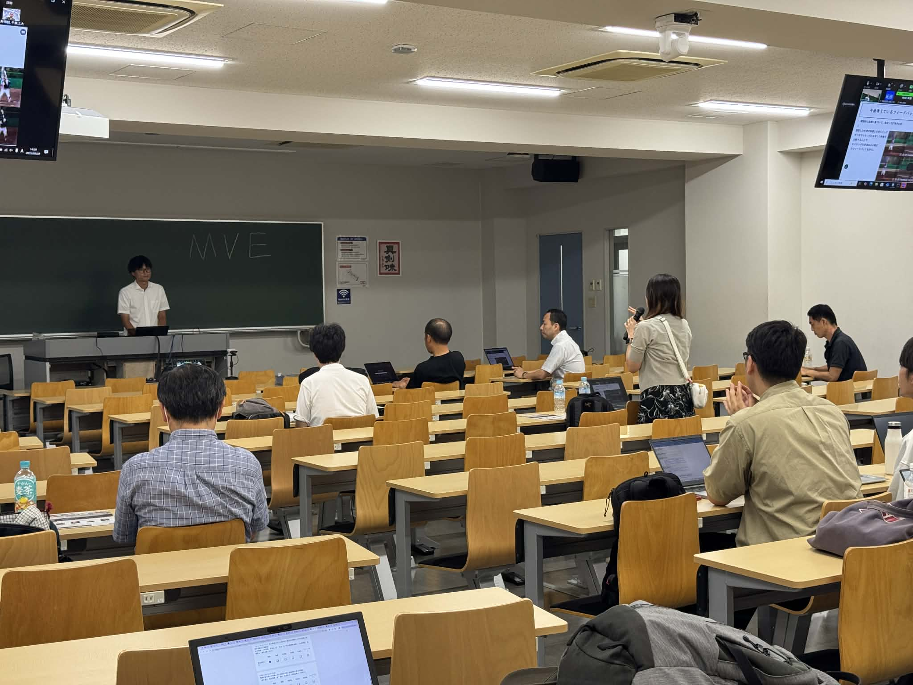
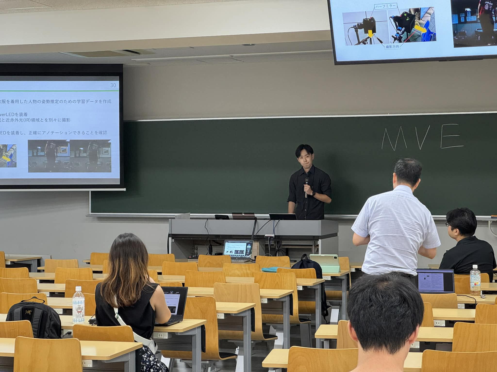
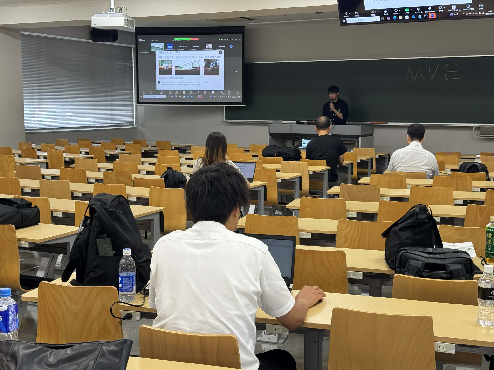

+++
date = '2025-08-29T17:56:48+09:00'
draft = false
title = '2025/8/28-29 MVE研究会＠中京大学にてM2青木さん、M1北野さん、B4石﨑さんが発表'
+++
電子情報通信学会MVE研究会が中京大学名古屋キャンパスで開催されました。

M2青木さん、M1北野さん、B4石﨑さんがそれぞれ発表しました。

  - 青木真吾, 北澤翔太, 西條直樹, 三上弾, 試合データに基づく打者のタイミング能力指標の評価 MVE2025-15, 2025.
  - 北野大志, 松村聖司, 西條直樹, 柏野牧夫, 三上弾, ゆったりとした衣服を着用した人物の姿勢推定 ～ IRカメラと赤外線LEDを用いた基礎検証 ～ MVE2025-12, 2025.
  - 石﨑大暉, 三上弾, 鏡を用いた投手と打者の同期撮影の省力化および高解像度化, MVE2025-17, 2025. 

活発に質疑頂けてとても勉強になる研究会でした．

<!--more-->

