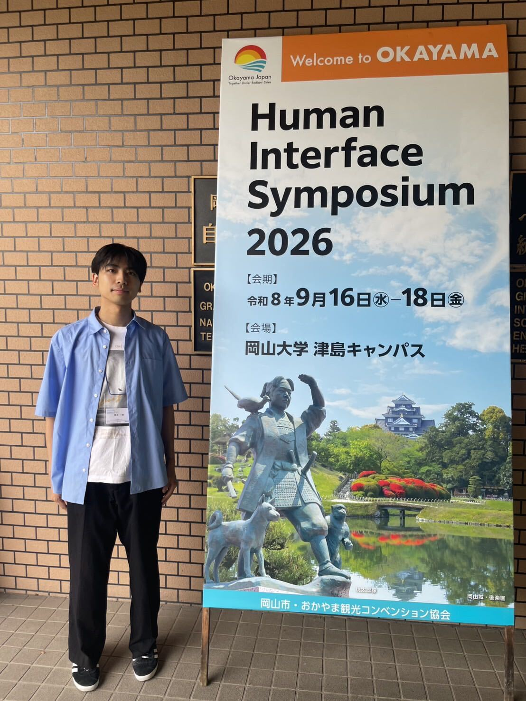
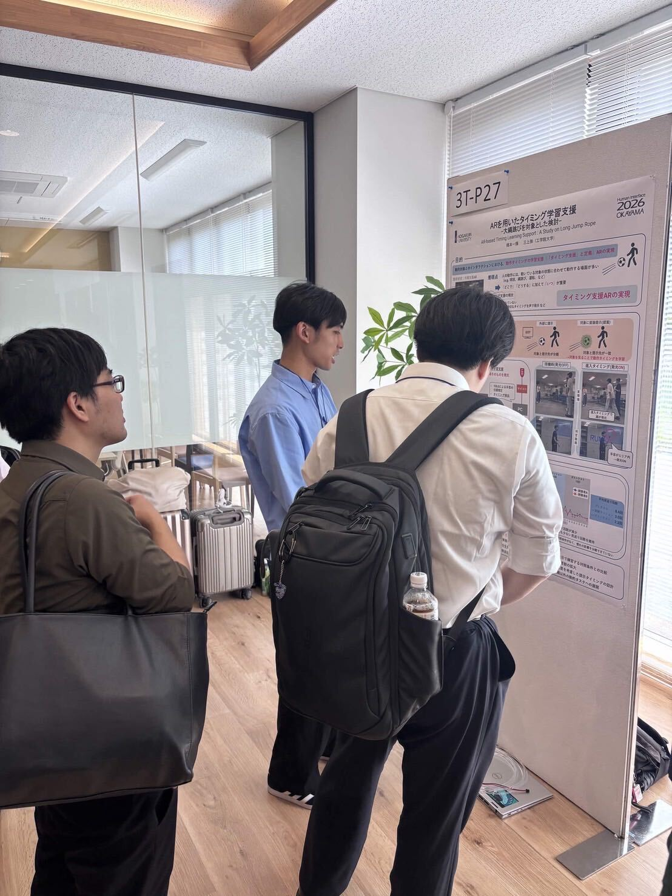
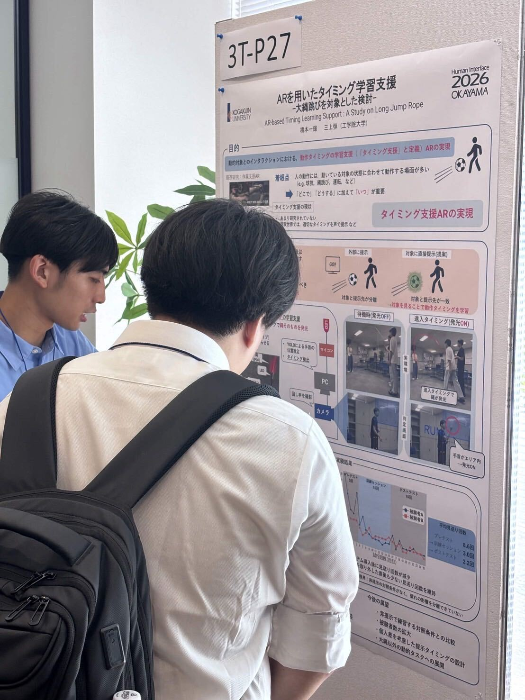

+++
date = '2026-09-18T17:56:48+09:00'
draft = false
title = '2026/09/16-18 ヒューマンインタフェースシンポジウム2026'
featured_image = "images/IMG_4230.jpg"
+++
2026年9月16-18日に岡山大学津島キャンパスでヒューマンインタフェースシンポジウム2026が開催されました。ユビキタスセンシング研究室からは、B4の橋本君が発表しました。

橋本一輝，三上弾，ARを用いたタイミング学習支援，ヒューマンインタフェースシンポジウム2026

ARで作業支援をする取り組みはたくさんありますが、作業のタイミングをARを使ってうまく学習するという取り組みはほとんどないという点に注目して、大縄跳びを題材にした取り組みをしてくれました。多くの皆さんと議論できてとても良かったです。

<!--more-->

