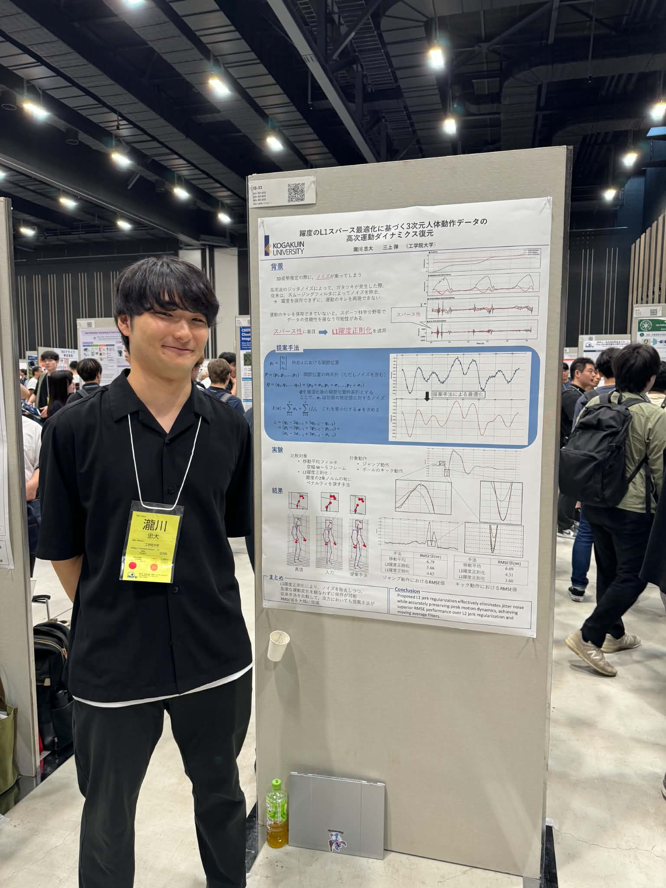
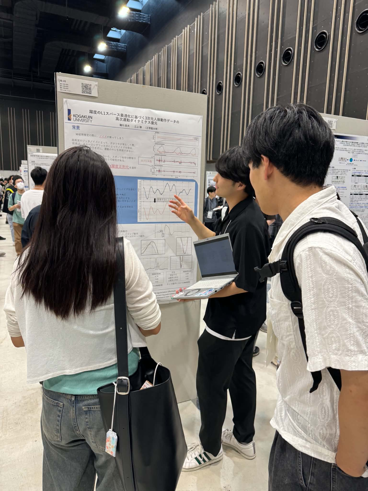
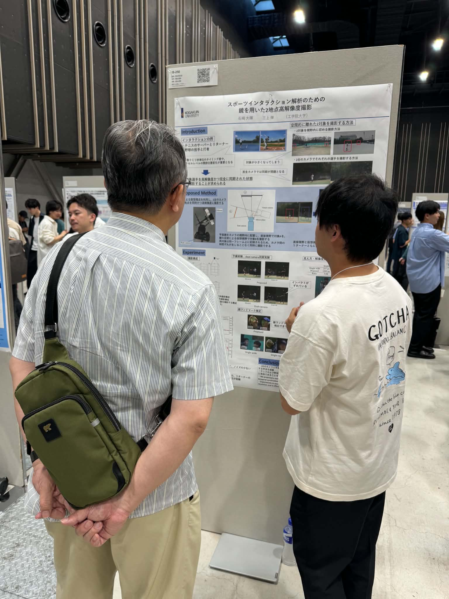
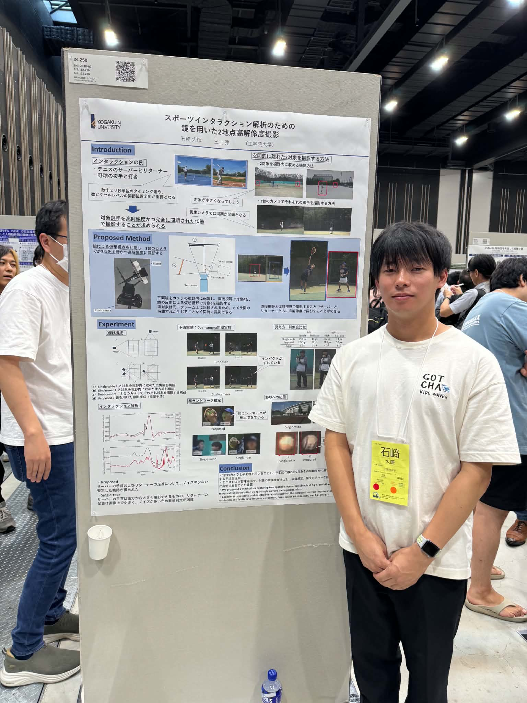
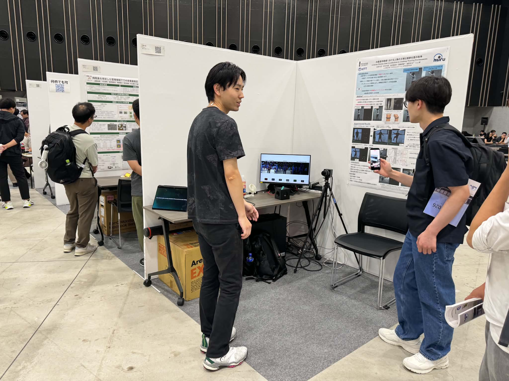
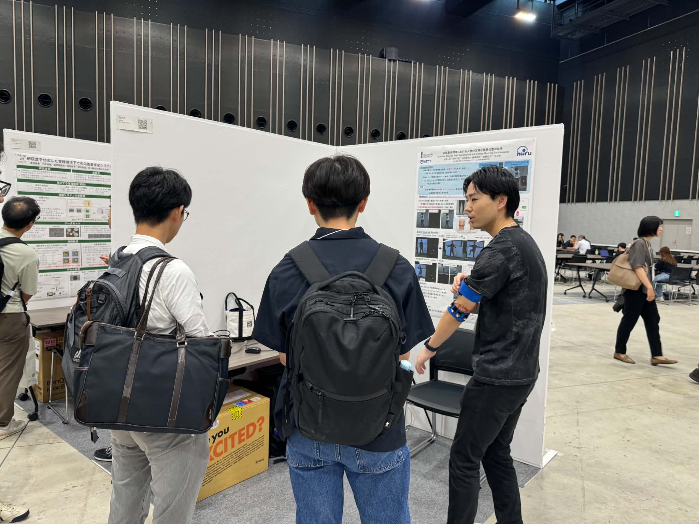
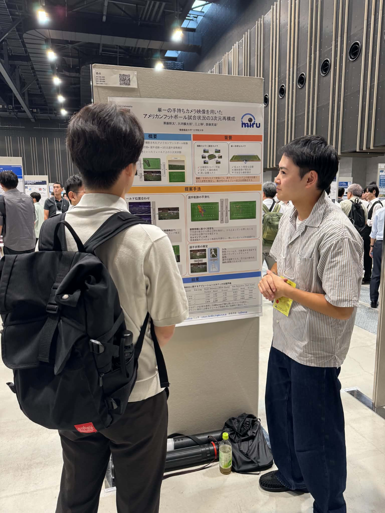

+++
date = '2026-08-05T17:56:48+09:00'
draft = false
title = '2026/08/3-6 MIRU（前半）'
featured_image = "images/kitano2.jpg"
+++
2026年8月3-6日にMIRU（画像の認識・理解シンポジウム）が長崎で開催されています。ユビキタスセンシング研究室からも4件の研究成果を発表しています。M1の学生が3件と、M2の学生が1件でタイトルは以下の通りです。

- 瀧川忠大, 三上弾（工学院大），躍度の$L_1$正則化を用いた姿勢推定系列の時系列最適化
- 石﨑大暉, 三上弾（工学院大），スポーツインタラクション解析のための鏡を用いた2地点高解像度撮影
- 伊藤彰吾, 北野大志, 三上弾（工学院大），動的環境を対象としたDFFによるDepth推定
- 北野大志, 中村千夏（工学院大）, 松村聖司, 西條直樹, 柏野牧夫（NTT）, 三上弾（工学院大），衣服着用環境における人物の正確な関節位置の取得

それに加えて、慶應義塾大学との共同研究の以下の発表があります。

- 澤藤幹太, 大坪麟太郎（慶大）, 三上弾（工学院大）, 斎藤英雄（慶大），単一の手持ちカメラ映像を用いたアメリカンフットボール試合状況の3次元再構成

今日までに、瀧川さんと石﨑さんの発表の発表が終わりました。明日は、伊藤さんの発表と、北野さんのデモ発表（デモ発表は8/4-6の3日通して発表です）があります。

MIRUは近年のコンピュータビジョン・機械学習の盛り上がりを反映して研究発表は盛況で、企業ブースも大変な賑わいでした。企業ブースで様々なことを教えてもらえたのは、就活中のM1の学生たちにとって視野を広げる良い機会にもなったのではないかと思います。

<!--more-->

