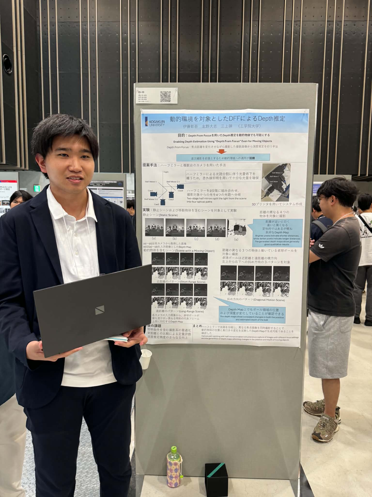
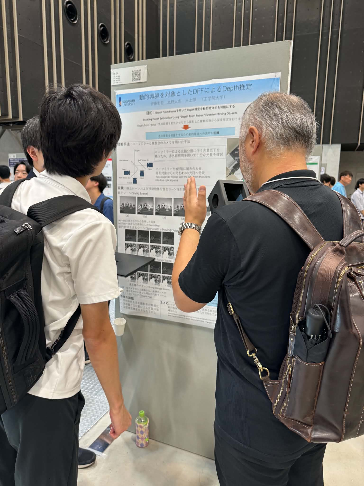
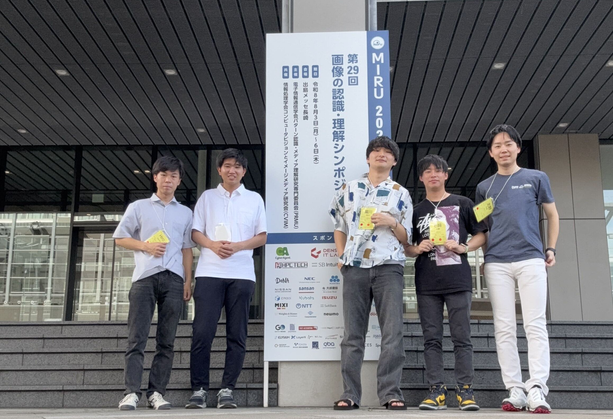

+++
date = '2026-08-06T17:56:48+09:00'
draft = false
title = '2026/08/3-6 MIRU（後半）'
featured_image = "images/MIRU2026.jpg"
+++
2026年8月3-6日にMIRU（画像の認識・理解シンポジウム）が長崎で開催されています。ユビキタスセンシング研究室からも4件の研究成果を発表しています。M1の学生が3件と、M2の学生が1件でタイトルは以下の通りです。

- 瀧川忠大, 三上弾（工学院大），躍度の$L_1$正則化を用いた姿勢推定系列の時系列最適化
- 石﨑大暉, 三上弾（工学院大），スポーツインタラクション解析のための鏡を用いた2地点高解像度撮影
- 伊藤彰吾, 北野大志, 三上弾（工学院大），動的環境を対象としたDFFによるDepth推定
- 北野大志, 中村千夏（工学院大）, 松村聖司, 西條直樹, 柏野牧夫（NTT）, 三上弾（工学院大），衣服着用環境における人物の正確な関節位置の取得

最終日の8/6には伊藤君のポスター発表がありました。

MIRUはポスターの時間が2時間あり、デモは2時間x3日間ということで、どの発表もたくさんの議論ができて、また、聴衆の方の質問のとても鋭くて刺激的でした。

来年もみんなで参加したいという気持ちを強くしました。

<!--more-->

