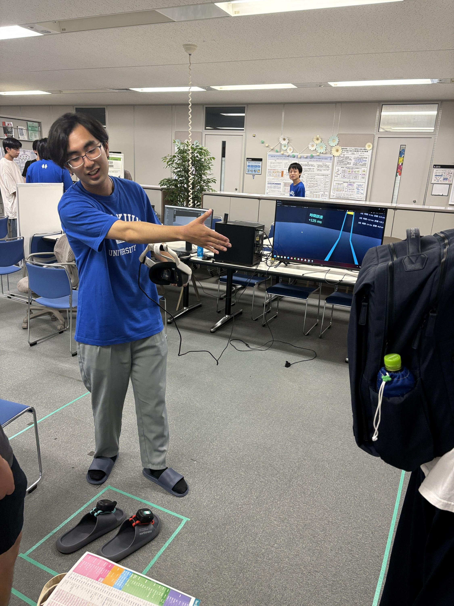
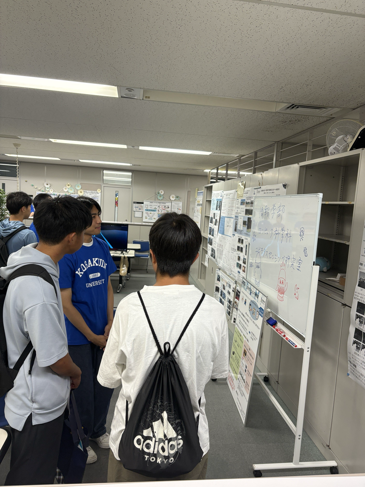
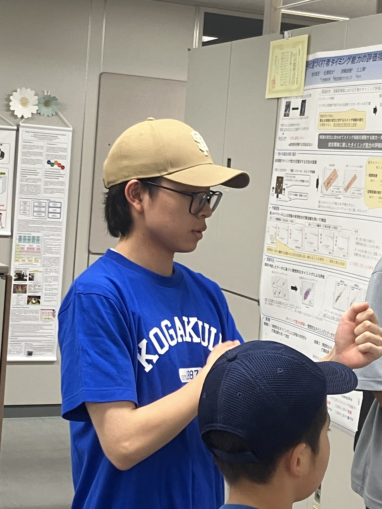
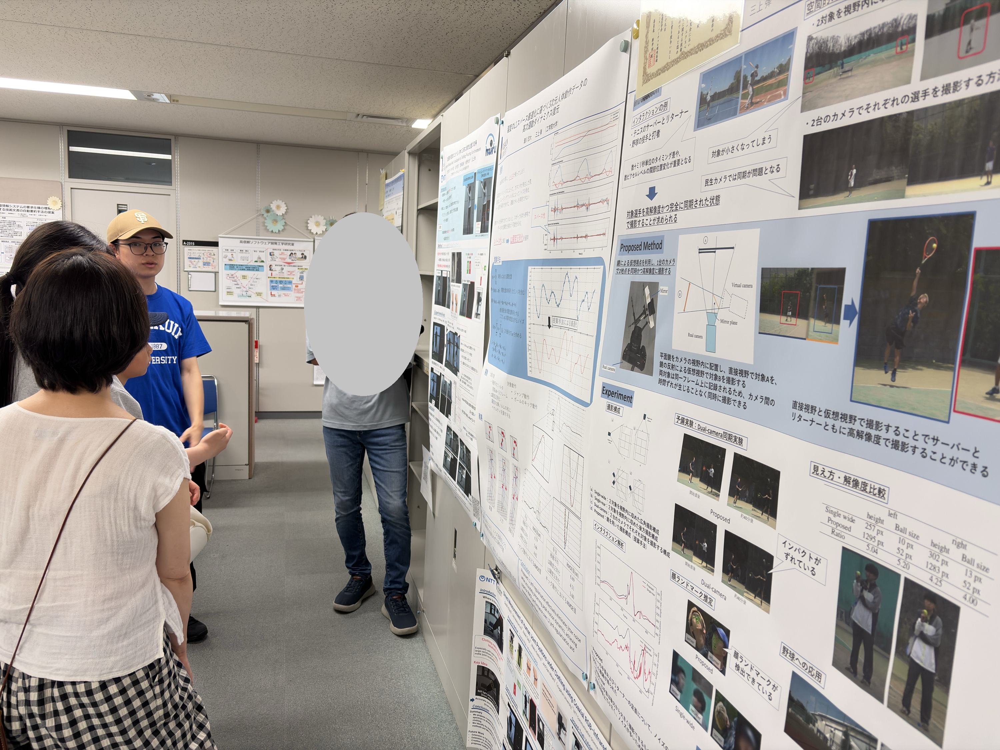

+++
date = '2026-08-01T17:56:48+09:00'
draft = false
title = '2026/08/1-2 オープンキャンパス'
featured_image = "images/IMG_5026.png"
+++
2026年8月1,2日に工学院大学新宿キャンパスのオープンキャンパスが開催されました。

ユビキタスセンシング研究室は、23Fのフリースペースでデモとポスターの展示を行いました。デモは、M1の山崎君が修士の取り組みに関係したVRのデモを作成してくれて、とても盛り上がりました。

また最近の学会発表のポスターについても興味を持って聞いてもらえて、公開した私たちにとっても有意義な活動になりました。

<!--more-->

