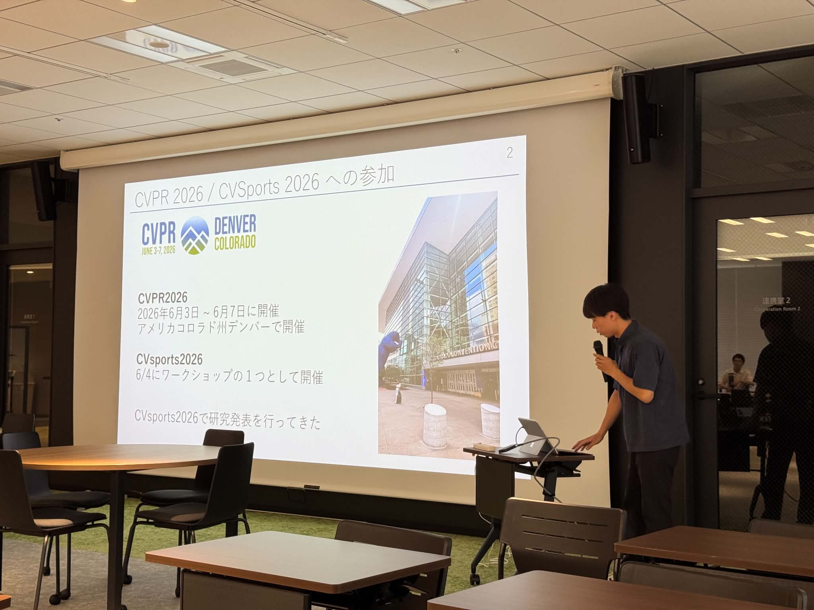
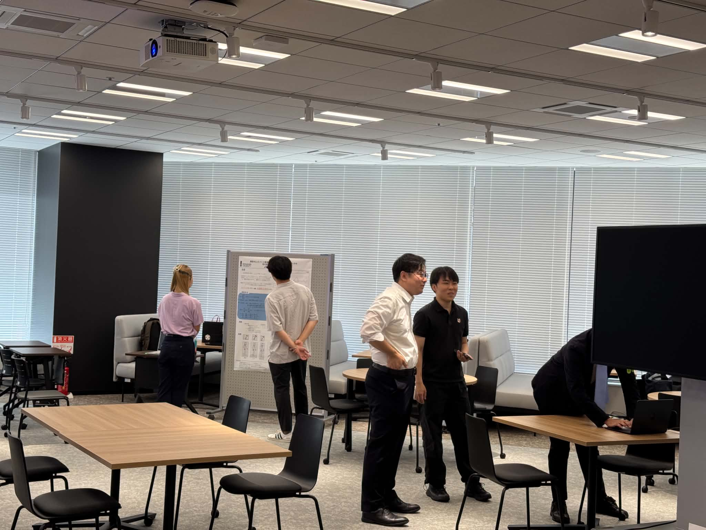
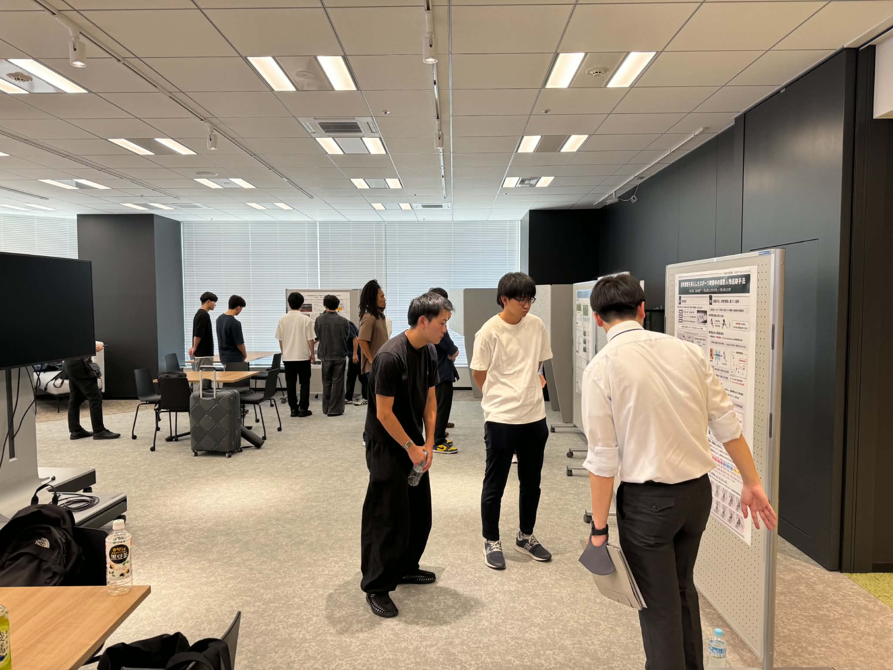
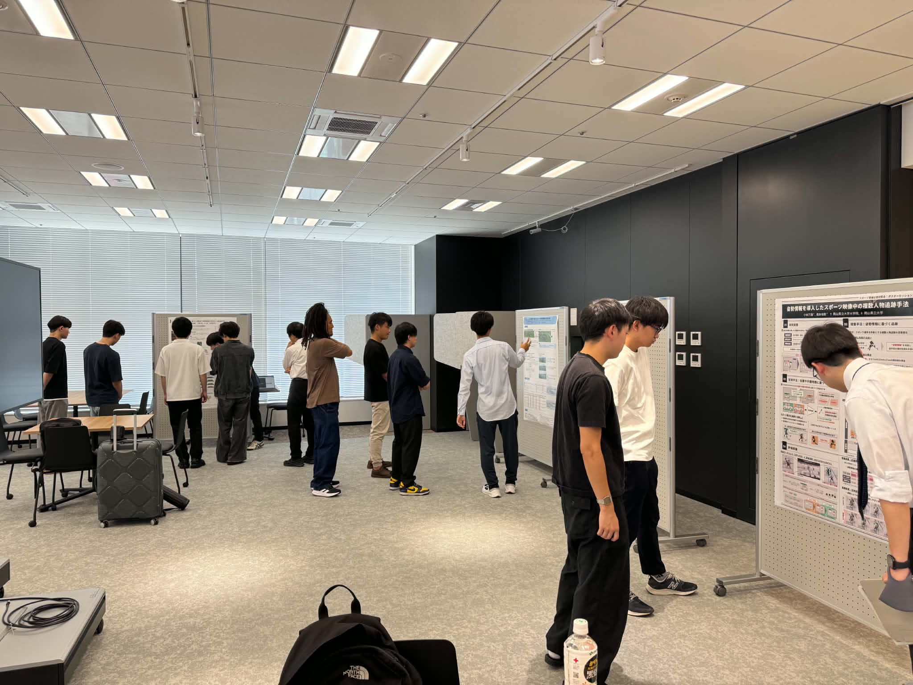
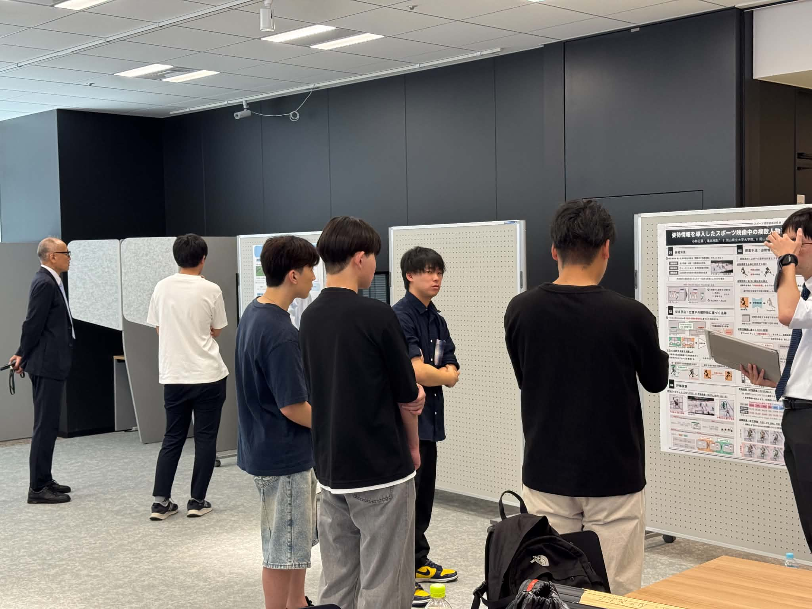

+++
date = '2026-08-05T17:56:48+09:00'
draft = false
title = '2026/08/7 スポーツ情報処理研究会'
featured_image = "images/horino.jpg"
+++
2026年8月7日に映像情報メディア学会スポーツ情報処理研究会が開催されました。MIRUから引き続き長崎ですが、会場はMIRUの出島メッセから、路面電車で2駅ぐらい離れた、長崎大学のスタジアムシティのキャンパスです。

今回のスポーツ情報処理研究会は、MIRUの内容をスポーツｘテクノロジーのコミュニティで密なディスカッションをすることを推奨する、というコンセプトでしたので、発表はMIRUとかなり重複しますが、

- 堀野陽路，北野大志，三上　弾（工学院大），赤外線影幾何に基づく視覚非干渉型単眼三次元ボール軌道計測
- 瀧川忠大, 三上弾（工学院大），躍度の$L_1$正則化を用いた姿勢推定系列の時系列最適化
- 石﨑大暉, 三上弾（工学院大），スポーツインタラクション解析のための鏡を用いた2地点高解像度撮影
- 伊藤彰吾, 北野大志, 三上弾（工学院大），動的環境を対象としたDFFによるDepth推定

の4件と、慶應義塾大学との共同研究

- 澤藤幹太, 大坪麟太郎（慶大）, 三上弾（工学院大）, 斎藤英雄（慶大），単一の手持ちカメラ映像を用いたアメリカンフットボール試合状況の3次元再構成

の発表がありました。一般の講演に加えて、堀野君がCVSports2026の参加報告をしてくれました。

- 堀野陽路，三上　弾（工学院大），CVsports2026参加報告 ～ 最新技術動向の紹介 ～

スポーツを題材に研究をするメンバーが集まり、きれいな会場で研究会が開催されてとても心地よい研究会でした。

<!--more-->

