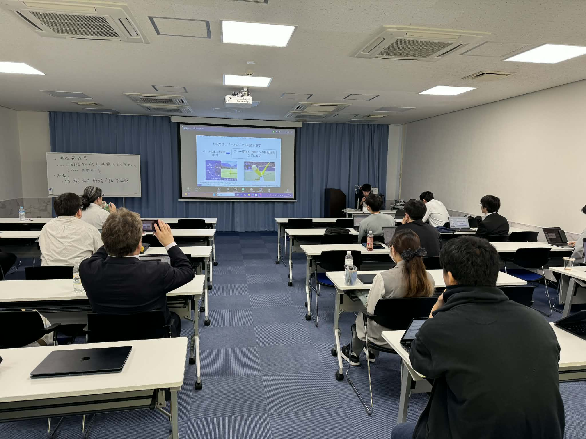
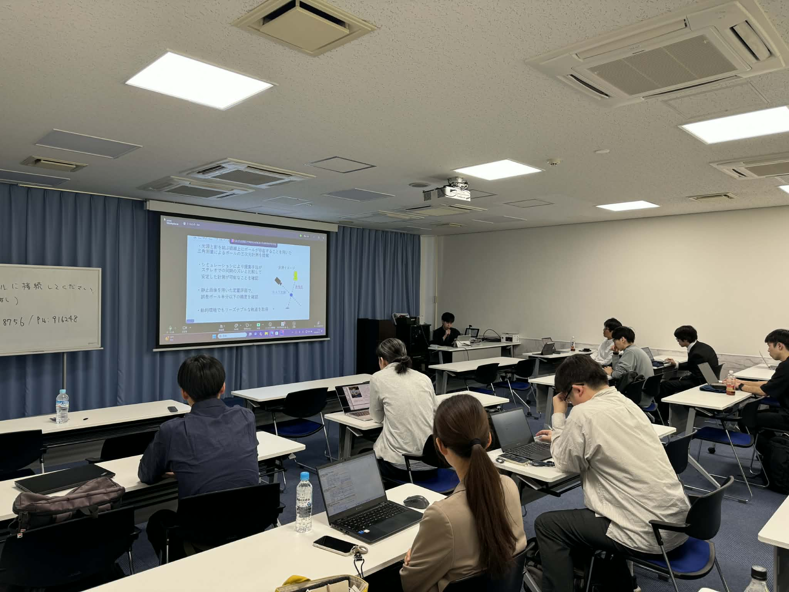
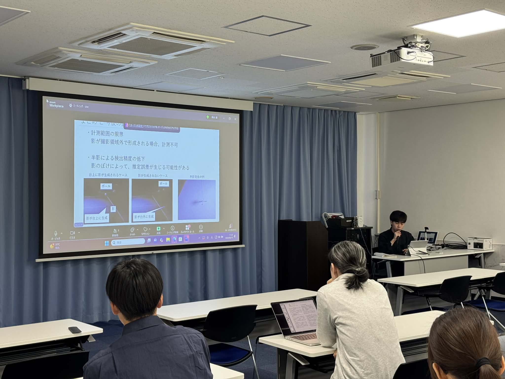
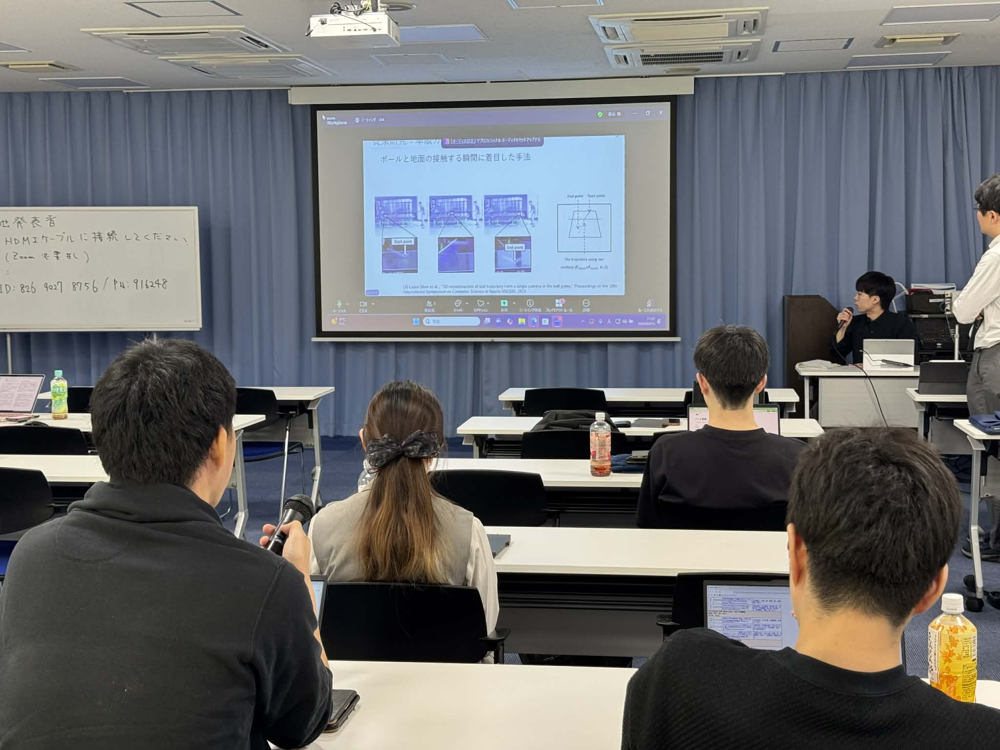

+++
date = '2026-03-16T17:56:48+09:00'
draft = false
title = '2026/03/16 MVE研究会 で堀野さんが発表'
featured_image = "/posts/2026_03MVE/1.jpg"
+++
2026年3月16日～18日に沖縄県那覇市で開催されているMVE3月研究会でB4の堀野さんが発表を行いました。堀野さんは、赤外光が作る影を用いて1台のカメラから精度良くボールの三次元軌道を推定する手法を提案しました。

発表後には聴講してくださった他大学の先生や、1月にあった国際会議IWAITで知り合った他大学の学生が詳しく話を聞いて下さって有意義な議論ができて良かったです。

<!--more-->

