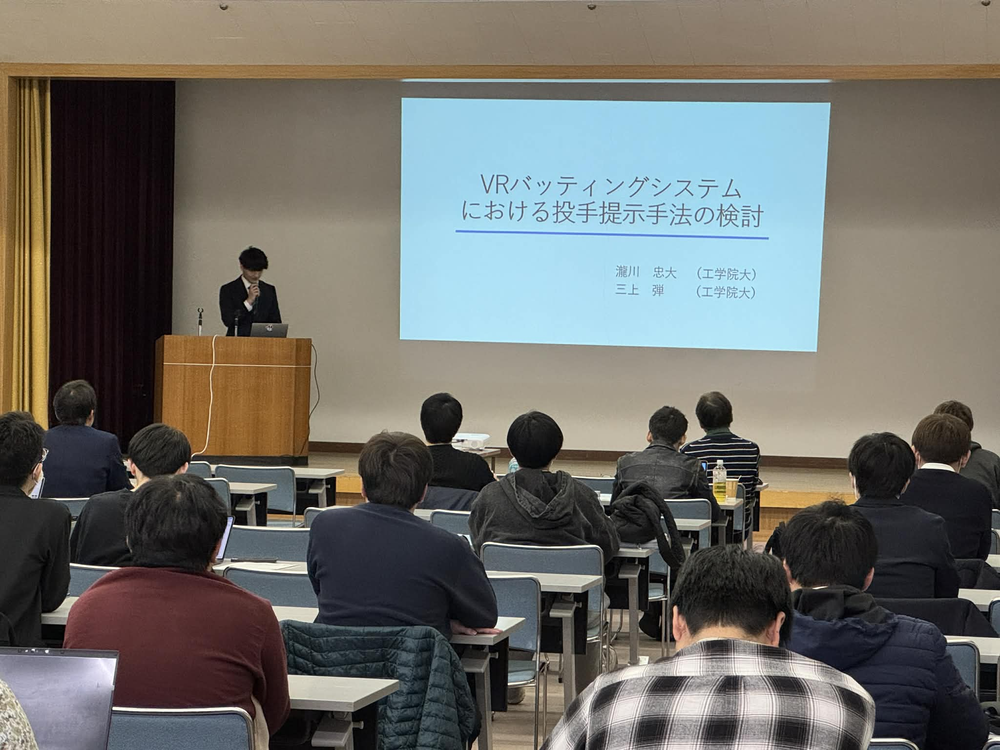
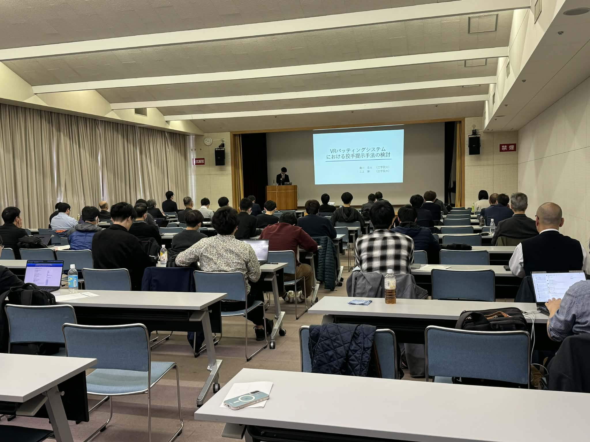
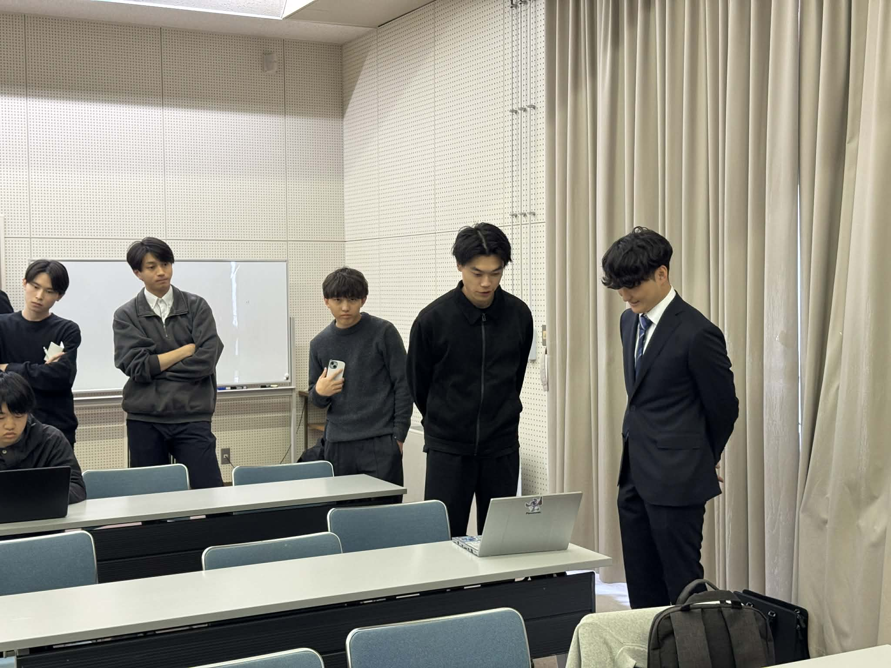
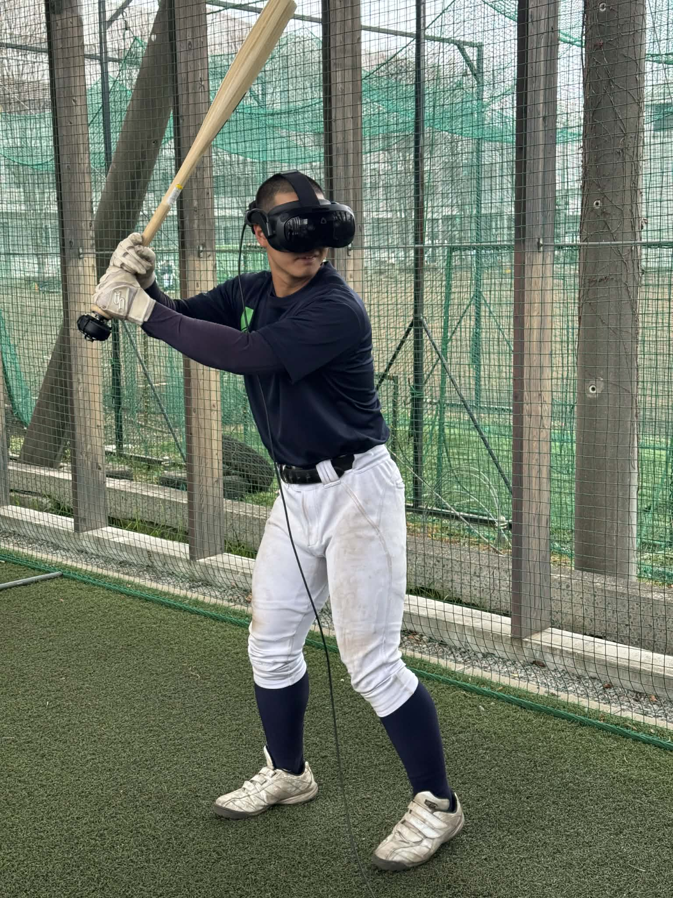
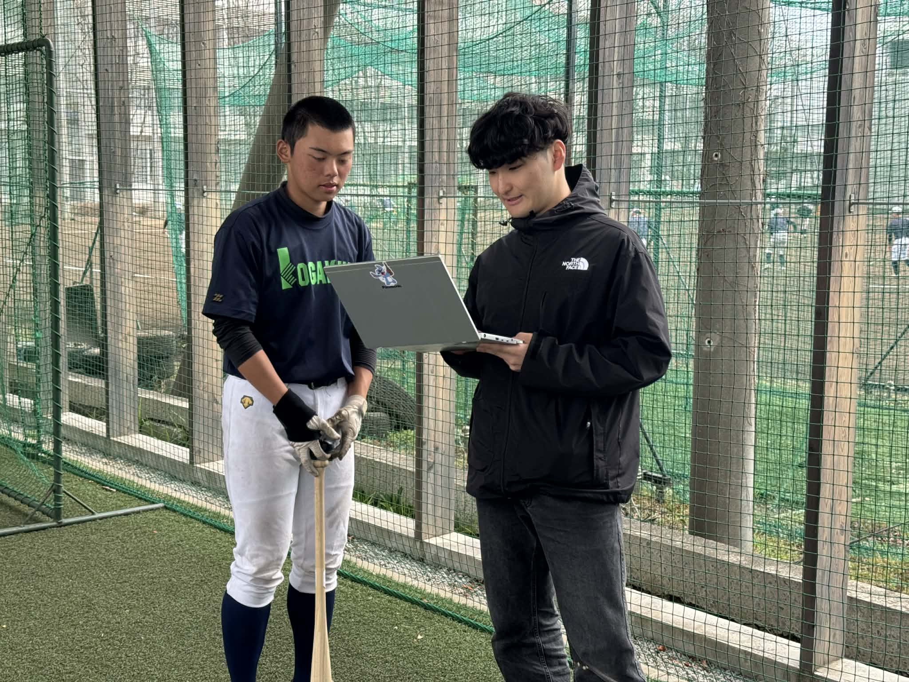
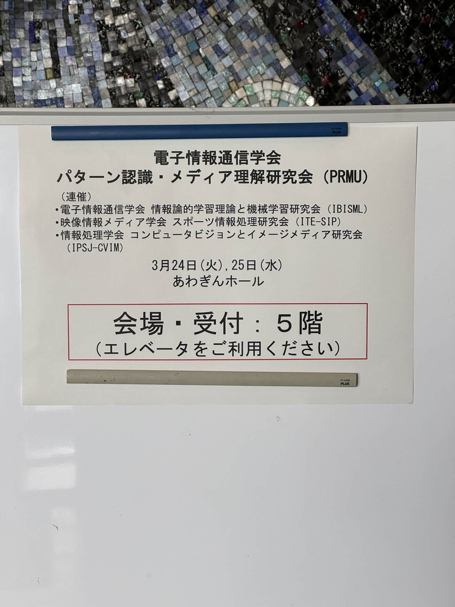

+++
date = '2026-03-24T17:56:48+09:00'
draft = false
title = '2026/03/24 ITE-SIP研究会 で瀧川さんが発表'
featured_image = "images/2026_03ITE1.jpg"
+++
2026年3月24日～25日に徳島県徳島市で開催されているPRMU/CVIM/IBISML/SIP合同研究会でB4の瀧川さんが発表を行いました。瀧川さんは、VRを用いた野球トレーニングシステムにおける投手の表現方法に関して、野球部の選手を対象に主観評価実験を行いその結果を発表しました。

結構大きな会場にたくさんの聴衆で緊張の学会発表デビューだったかと思います。PRMUは発表時には質疑応答がなく、セッション最後に30分のディスカッションタイムが設けられています。ディスカッションタイムにも多くの方が聞いて下さいました。

発表にあたっては、工学院大学付属高校の野球部に協力頂きました。ありがとうございました！

<!--more-->

