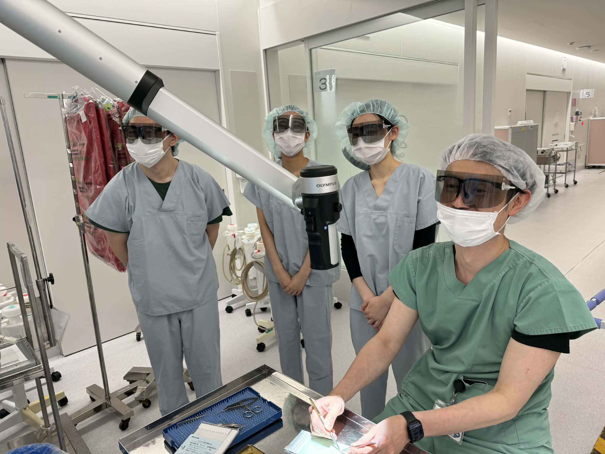
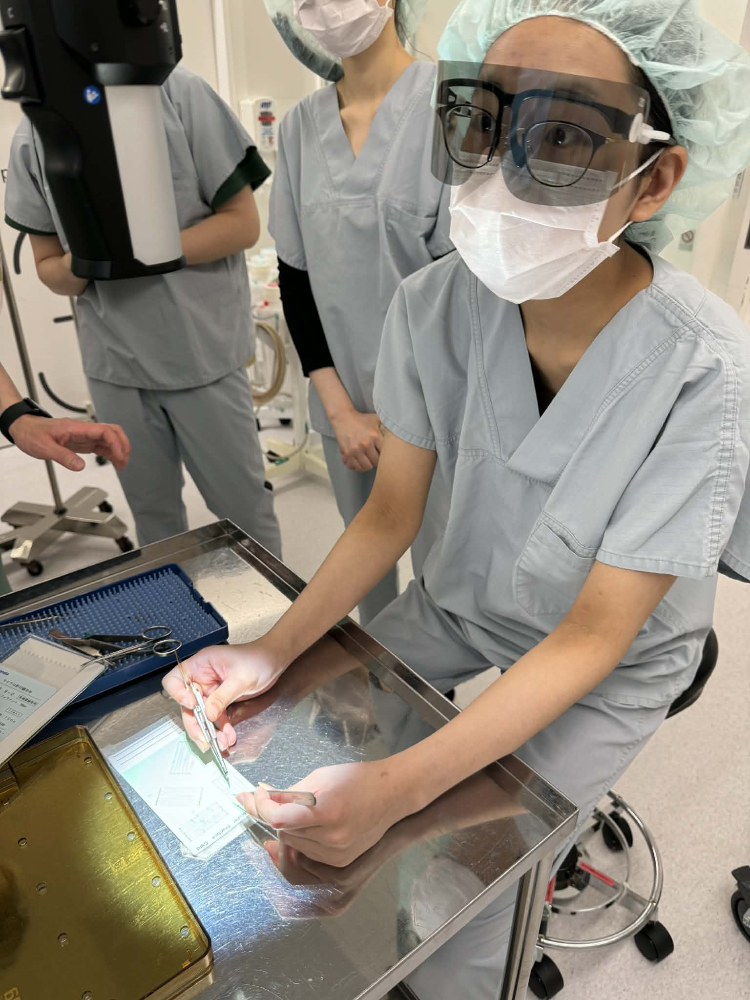

+++
date = '2026-04-21T17:56:48+09:00'
draft = false
title = '2026/04/21 共同研究打ち合わせ＠東医大'
featured_image = "images/20260421.jpg"
+++
4年生3名と共同研究の打ち合わせに東京医大に行きました。マイクロサージャリーという顕微鏡下で対象を拡大しながら行う手術のスキル向上を目指した研究を検討中のため、実際にOrbeyeという最新の外視鏡を少し体験させて頂きました。外視鏡では、立体ディスプレイに顕微鏡映像を映します。術者が3D眼鏡をかけることで左右の目に異なる映像が提示され立体に見ることができるようになります。学生たちは、細かい作業で手がプルプルしてしまっていましたが、先生はとてもスムーズに作業されていて、プロの技術に驚愕してきました。

<!--more-->

