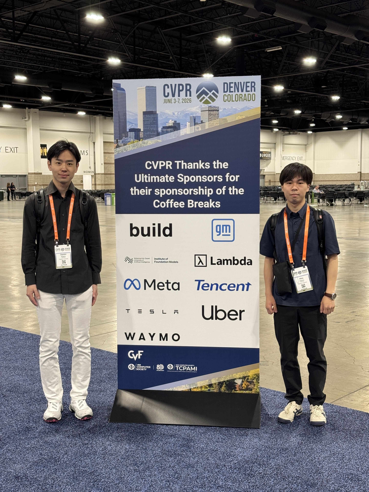
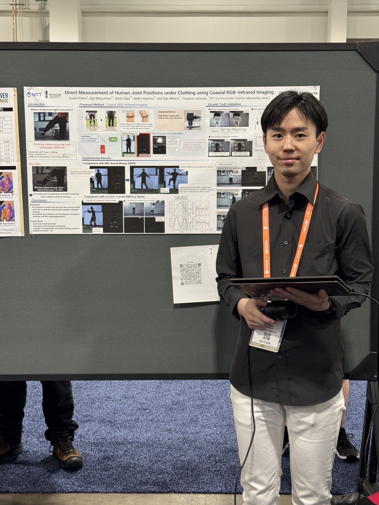
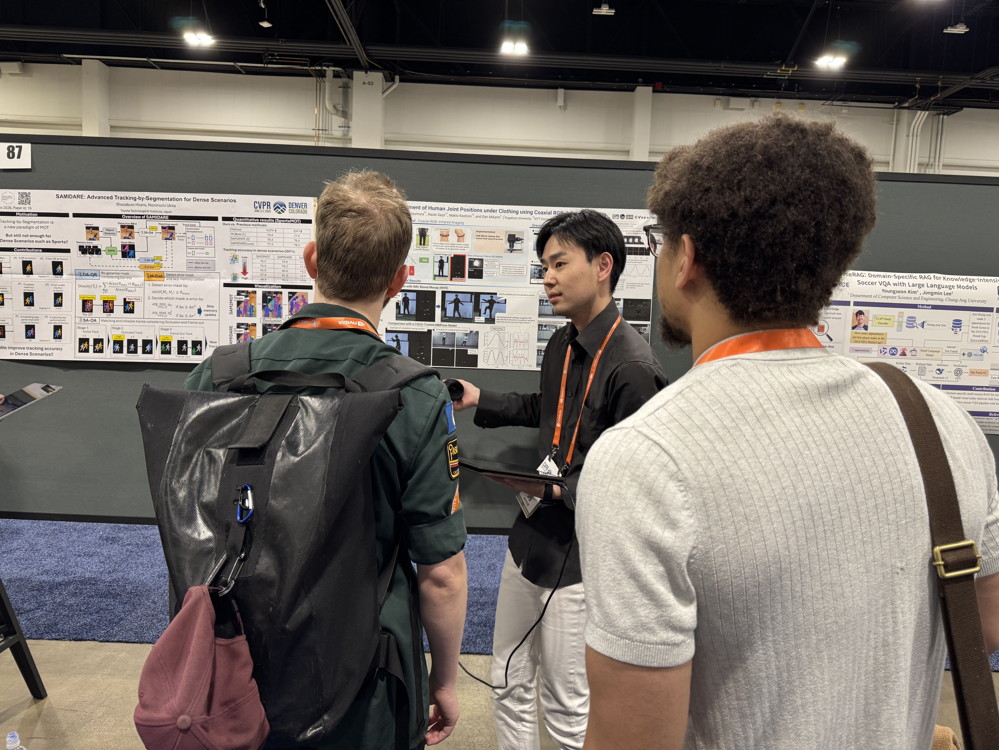
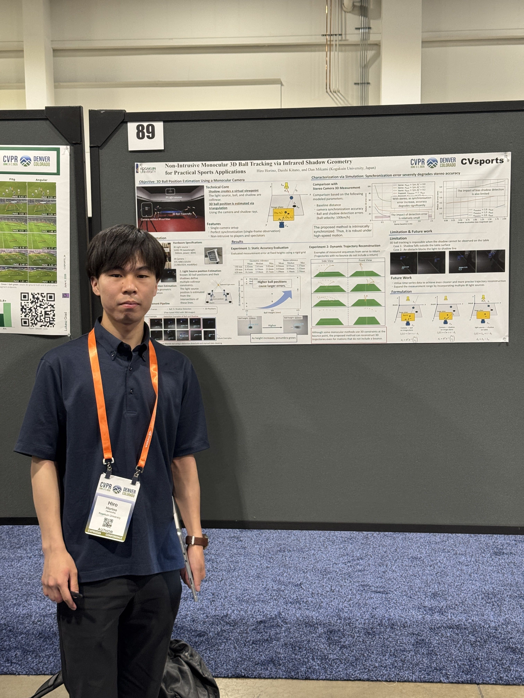
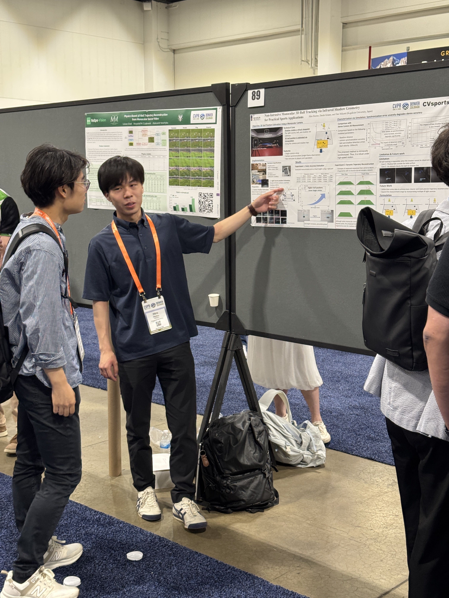

+++
date = '2026-06-06T17:56:48+09:00'
draft = false
title = '2026/06/4 CVPRW CVSports で、M2北野さん、M1堀野さん発表'
+++

CV分野最難関国際会議のひとつであるCVPRに参加しています。M2の北野さん、M1の堀野さんがWorkshopであるCVSportsで発表しました。CVSportsは今年で12回目と伝統あるワークショップです。

<!--more-->

* 北野さんの発表

Daishi Kitano, Seiji Matsumura, Naoki Saijo, Makio Kashino, and Dan Mikami, Direct Measurement of Human Joint Positions under Clothing using Coaxial RGB–Infrared Imaging, Proceedings of CVPR Workshops (CVSports), 2026

* 堀野さんの発表

Hiro Horino, Daishi Kitano, and Dan Mikami, Non-Intrusive Monocular 3D Ball Tracking via Infrared Shadow Geometry for Practical Sports Applications, Proceedings of CVPR Workshops (CVSports), 2026

2人とも初めての国際会議参加でしたが、頑張って発表してくれました。

* ふたりからのコメント

** 北野さん

2026年6月4日、私はCVPR 2026のワークショップであるCVSports 2026において、自身の研究成果をポスター発表する機会をいただきました。採択が決まったときは大変嬉しかった一方で、発表が近づくにつれて、英語でうまく説明できるか、質問にきちんと答えられるかといった不安も大きくなっていきました。

しかし、セッション開始前に出会ったマイケルという研究者（cencer detectionに関する研究をしているらしい）との会話が、その不安を和らげてくれました。お互いの研究について話す中で、流暢な英語でなくても、身振り手振りを交えながら伝えようとすれば理解してもらえることを実感しました。この経験を通じて、「完璧な英語」よりも「伝えようとする姿勢」が大切だと感じることができ、発表に向けた気持ちも前向きなものになりました。

ポスターセッションでは、簡単なデモも実施しました。実際に動作する様子を見て興味を持ってくださる方も多く、デモをきっかけに議論が始まる場面もありました。参加者の方々からは、「データセットとして完成すれば面白い」といった意見をいただいた一方で、「自動化されていない部分が多く、大変そうだ」といった率直な指摘もいただきました。

こうしたフィードバックを通じて、自身の研究がまだ発展途上であることを改めて実感しました。同時に、研究の可能性を評価していただけたことは大きな励みとなり、今後も研究を発展させていきたいという気持ちがより強くなりました。

** 堀野さん

この度、１万人以上が参加するコンピュータビジョン分野のトップカンファレンスCVPR 2026で開催されたスポーツ分野に特化したワークショップCVsportsに参加させていただきました。
このような高いレベルの学会に参加できたことは、不安もありましたが、それ以上に今後の研究
活動に向き合う大きな刺激となりました。

ポスターセッションでは、拙い英語ながらも海外の研究者の方に自分の研究を伝えることができたときは、非常にうれしく感じました。また、研究課題に対する具体的な改善策やアプローチについてディスカッションを行うことができ、今後の研究を進めるうえで参考となる意見をいただくことができました。

CVPRの朝は想像以上に早く、早いセッションでは朝7時から始まるため、早起きが欠かせない生活を送っています。1週間前の自分では考えられない生活リズムですが、多くの研究者による発表に触れることのできる貴重な機会を楽しんでいます。
今回の経験を糧に、研究の質をさらに高め、より良い研究成果につなげていきたいと思います。

