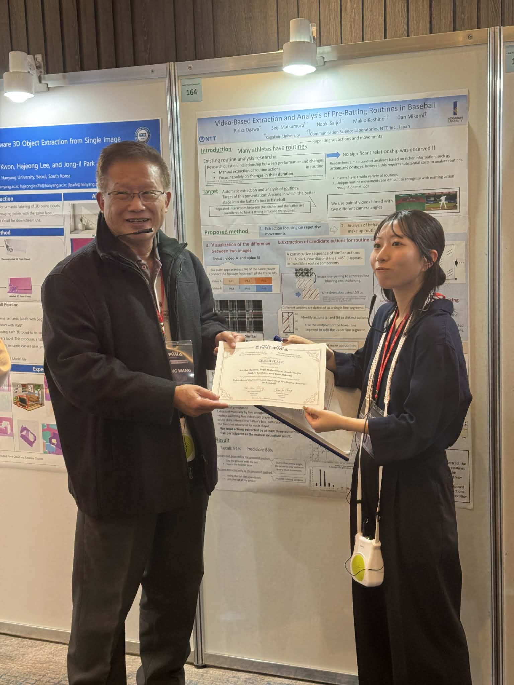
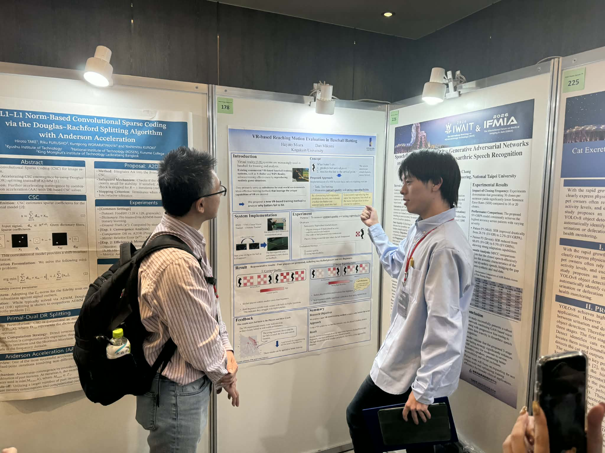
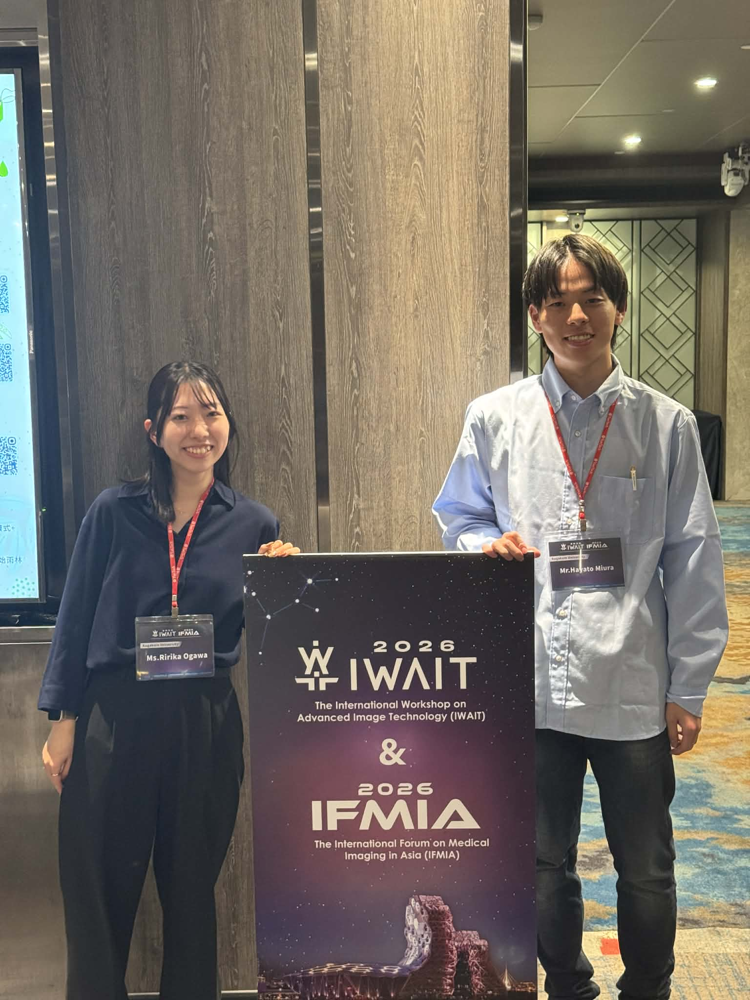

+++
date = '2026-01-13T17:56:48+09:00'
draft = false
title = '2026/01/15 IWAIT2026 で小川さん、三浦さんが発表'
+++
2026年1月12日～13日に台湾の高雄で開催されたIWAIT2026でM2の小川さんと三浦さんがそれぞれ発表を行いました．小川さんは，打者が打席に入る際のルーティンを自動抽出し，変化を分析する取り組みを発表しました．三浦さんは，VRを用いたバッティングトレーニングの新しい形態としてティーバッティングを，詳細なスイング分析をしながら実行するという練習方法の提案を発表しました．

<!--more-->

